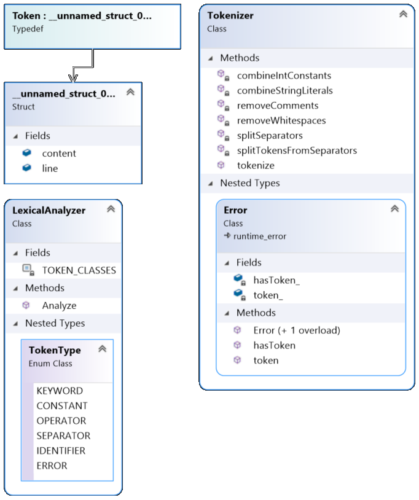

# FLCD Compiler

# Scanner

## Requirement
Considering a small programming language, the requirement is to write a scanner (lexical analyzer) for it.

## Design


### Splitting source into tokens
This is performed by the [Tokenizer](Tokenizer.h), by first obtining an initial list of tokens from a source file and then by refining the list in multiple steps.

### Lexical analysis
The [LexicalAnalyzer](LexicalAnalyzer.h) receives the output of the Tokenizer and generates a [symbol table](https://github.com/cata-b/FLCD-Symbol-Table) and a PIF (Program Internal Form), while also classifying the tokens and returning those tokens which do not fall in one of the classes. Token classification is done by using regular expressions, except for identifiers and integer constants, for which a [finite automatons](https://github.com/cata-b/FLCDFiniteAutomaton) are used.

## Code
In order to clone the entire project (even the submodules), use `git clone --recurse-submodules https://github.com/cata-b/FLCDCompiler`

### The Tokenizer class
### Public Methods:
```C++ 
static std::vector<Token> tokenize(std::string filename);
```
Reads input from a file and splits it into tokens.

Throws a `Tokenizer::Error` when the tokenizer cannot read a file or cannot split the content into tokens correctly.

Splitting is performed in multiple steps:
- `splitTokensFromSeparators` reads a file and splits it into strings based on separators (e.g. if and "); are separate tokens);
- `splitSeparators` splits the separator-only strings, but takes into account operators such as +=;
- `removeComments` removes single-line comments;
- `combineIntConstants` combines integers with a previous sign;
- `combineStringLiterals` combines string constants;
- `removeWhitespaces` removes whitespaces that are outside of constants

### The LexicalAnalyzer class
### Public Methods:
```C++
static std::vector<Token> Analyze(
    std::vector<Token> tokens, 
    SymbolTable& symbolTable, 
    std::vector<std::tuple<Token, TokenType, SymbolTable::Position>>& pif
);
```
Analyzes and classifies tokens.

Parameters:
- `tokens`: Tokens, as returned by `Tokenizer::tokenize`
- `symbolTable`: Output parameter that will contain all the identifiers and constants from the tokens
- `pif`: Output parameter that will contain tokens, their type, and their positions in the symbol table (if a token is not inserted in the symbol table, the position is the `SymbolTable::end` of that table)

This method returns all the tokens that could not be classified.

## Test Examples
The program takes as command arguments a source file, an output file for the program internal form and an output file for the symbol table.

| Input Program          | Outputs                        |
| ---------------------- | ------------------------------ |
| [p1.txt](p1.txt)       | [outputs/p1](outputs/p1)       |
| [p3.txt](p3.txt)       | [outputs/p3](outputs/p3)       |
| [p2.txt](p2.txt)       | [outputs/p2](outputs/p2)       |
| [p1err.txt](p1err.txt) | [outputs/p1err](outputs/p1err) |
